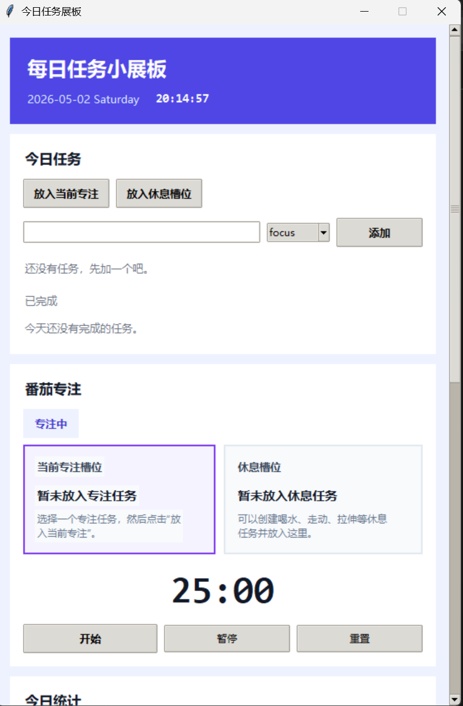
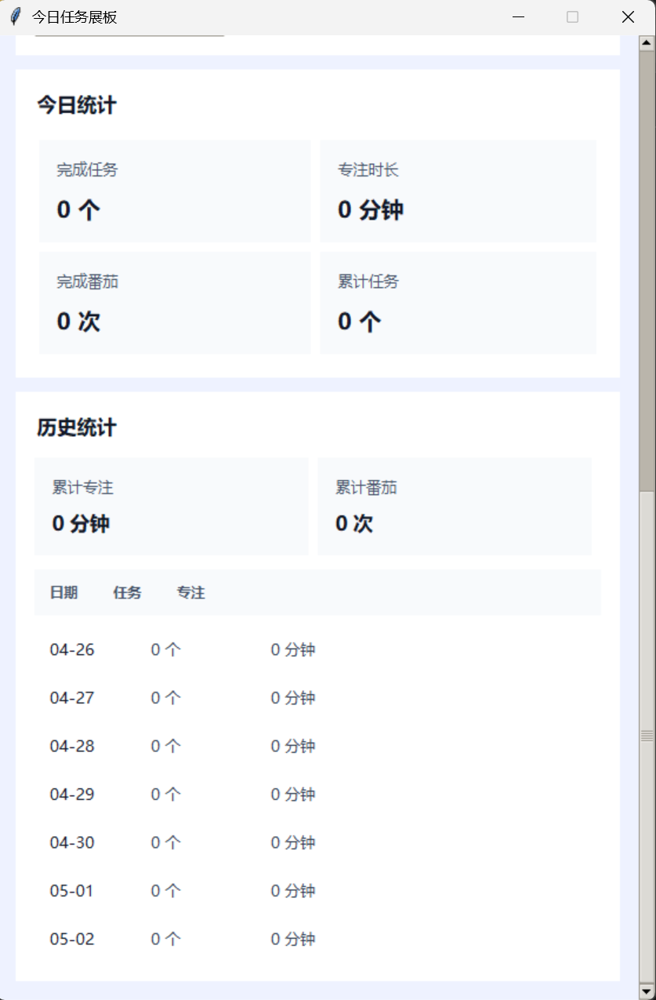

# FocusBoard

> A lightweight Windows desktop planner for tasks, Pomodoro focus, and local progress tracking.  
> 一个轻量的 Windows 桌面任务展板，用来规划每日任务、进行番茄专注，并在本地记录你的进度。

## Preview | 界面预览

### Main dashboard | 主界面



### Tasks and stats view | 任务与统计视图



## Why FocusBoard? | 为什么做 FocusBoard？

**EN**  
FocusBoard is designed for people who want a clean desktop productivity tool without accounts, ads, or cloud lock-in. It helps you organize today’s tasks, switch naturally between focus and break modes, and keep your data private on your own machine.

**中文**  
FocusBoard 面向想要「打开就能用」的用户：不需要登录，没有广告，也不依赖云端。你可以用它整理今天的任务，在专注与休息之间自然切换，并把所有数据保留在自己的电脑里。

## Features | 功能特性

### EN
- Daily task board for focus tasks and break tasks
- Pomodoro timer with focus mode and break mode
- Click the focus slot or break slot to switch modes instantly
- Assign selected tasks into the current focus slot or break slot
- Daily stats for completed tasks, focus minutes, and Pomodoro count
- Recent history and cumulative records
- Automatic day rollover for long-term use
- Fully local JSON storage for privacy-first tracking
- Compact scrollable desktop UI built with Tkinter

### 中文
- 支持专注任务与休息任务的每日任务展板
- 内置番茄钟，包含专注模式和休息模式
- 点击专注槽位或休息槽位即可快速切换状态
- 可将选中的任务放入当前专注槽位或休息槽位
- 统计每日完成任务数、专注时长与番茄次数
- 提供近期历史记录与累计统计
- 支持自动跨日归档，适合长期使用
- 所有数据保存在本地 JSON 文件中，更注重隐私
- 使用 Tkinter 构建，界面紧凑、可滚动

## Use Cases | 适用场景

**EN**  
FocusBoard works well for students, solo developers, creators, and anyone who wants a simple visual board to plan the day and stay focused.

**中文**  
它尤其适合学生、独立开发者、创作者，以及任何希望通过简单可视化面板来安排一天并保持专注的人。

## Tech Stack | 技术栈

- Python
- Tkinter
- Local JSON storage | 本地 JSON 存储

## Project Structure | 项目结构

```text
main.py        # app entry point | 程序入口
app.py         # UI and workflow | 界面与交互逻辑
pomodoro.py    # timer state machine | 番茄钟状态机
storage.py     # local persistence | 本地持久化
stats.py       # stats aggregation | 统计汇总
data/          # local runtime data | 本地运行数据
pictures/      # screenshots for README | README 截图资源
```

## Run Locally | 本地运行

```bash
python main.py
```

## Build EXE | 打包 EXE

```bash
python -m PyInstaller --noconsole --onefile --name FocusBoard main.py
```

The packaged executable will be generated in the `dist/` directory.  
打包后的可执行文件会生成在 `dist/` 目录下。

## Privacy | 隐私说明

**EN**  
FocusBoard stores your tasks, focus sessions, and statistics locally in `data/data.json`. The repository already ignores this file by default, so your personal usage data will not be uploaded unless you add it manually.

**中文**  
FocusBoard 会将任务、专注记录和统计数据保存在本地的 `data/data.json` 中。仓库已经默认忽略该文件，因此你的个人使用数据不会被自动上传，除非你手动加入版本控制。

## Open Source License | 开源协议

This project is licensed under the MIT License.  
本项目使用 MIT License 开源。

## Recommended GitHub Title & Description | 推荐的 GitHub 标题与简介

### Repository Title
**FocusBoard**

### Short Description
**EN**  
A lightweight Windows desktop task board with Pomodoro focus, break slots, and privacy-first local tracking.

**中文**  
一个轻量的 Windows 桌面任务展板，集成番茄专注、休息槽位和本地隐私记录。

### Alternative Promotional Description
**EN**  
Plan your day, focus deeply, switch smoothly between work and rest, and keep every record on your own desktop.

**中文**  
规划今天的安排，进入深度专注，在工作和休息之间顺畅切换，并把每一条记录都留在自己的电脑上。
